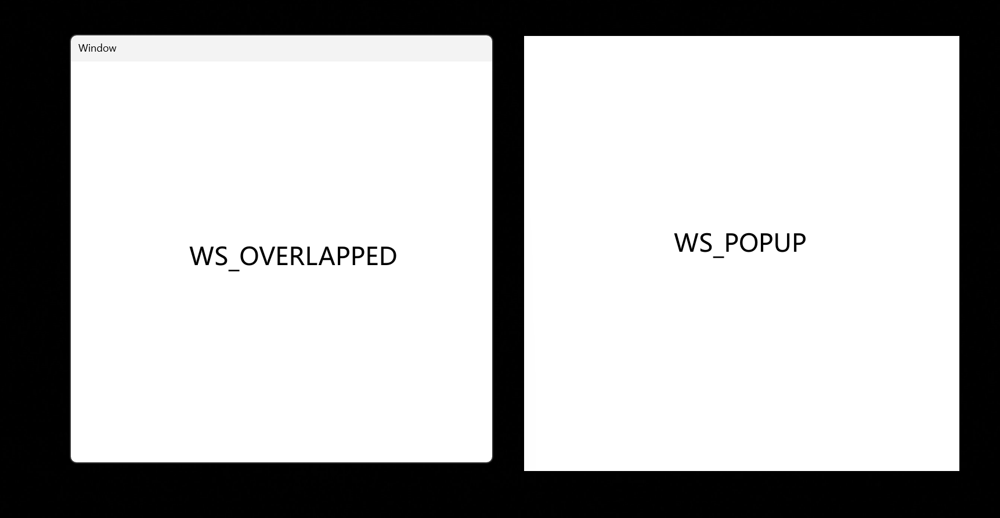
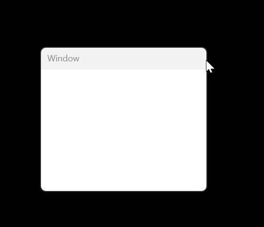
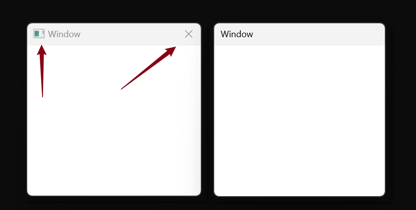

## 第一个窗口程序

Win32窗口按照一下顺序创建:

- 定义窗口 (WNDCLASSEX 结构体)

- 注册窗口 (RegisterClassEx)

- 创建窗口 

- 显示窗口

- 更新窗口 (非必须???)

- 消息循环

- 窗口过程 WndProc

<details>
<summary>第一个窗口程序代码，点击展开</summary>

```cpp
#include <windows.h>
#include <tchar.h>

LRESULT CALLBACK WindowProc(HWND, UINT, WPARAM, LPARAM);

int wWinMain(HINSTANCE hInstance, HINSTANCE hPreIns, LPWSTR lpCmdLine, int nShowCmd)
{
	TCHAR szWndClassName[] = __T("MyWindow");
	TCHAR szAppName[] = __T("Hello Window");

	WNDCLASSEX wndclass{ 0 };
	wndclass.cbClsExtra = 0;
	wndclass.cbSize = sizeof(wndclass);
	wndclass.cbWndExtra = 0;
	wndclass.hbrBackground = (HBRUSH)GetStockObject(GRAY_BRUSH);
	wndclass.hCursor = LoadCursor(NULL, IDC_ARROW);
	wndclass.hIcon = LoadIcon(NULL, IDI_APPLICATION);
	wndclass.hIconSm = NULL;
	wndclass.hInstance = hInstance;
	wndclass.lpfnWndProc = WindowProc;
	wndclass.lpszClassName = szWndClassName;
	wndclass.lpszMenuName = NULL;
	wndclass.style = CS_HREDRAW | CS_VREDRAW | CS_NOCLOSE | CS_DBLCLKS;
	
	RegisterClassEx(&wndclass);
	
	DWORD dwExStyle = WS_EX_TOPMOST;
	DWORD dwStyle = WS_OVERLAPPEDWINDOW;
	
	HWND hWnd = CreateWindowEx(dwExStyle, wndclass.lpszClassName, szAppName, dwStyle, 
		800, 380, 860, 560, 
		NULL, NULL, hInstance, NULL);
	
	ShowWindow(hWnd, nShowCmd);
	UpdateWindow(hWnd);
	
	MSG msg;
	while (GetMessage(&msg, NULL, 0, 0)!= 0)
	{
		TranslateMessage(&msg);
		DispatchMessage(&msg);
	}
	return -1;
}

LRESULT CALLBACK WindowProc(HWND hWnd, UINT msg, WPARAM wPara, LPARAM lPara)
{
	switch (msg)
	{
	
		case WM_DESTROY:
		{
			PostQuitMessage(0);
			return 0;
		}
	}
	return DefWindowProc(hWnd, msg, wPara, lPara);
}
```
</details>


WNDCLASSEX数据结构如下:

```cpp
typedef struct _WNDCLASSEX {
    UINT     cbSize;             // 结构体的大小           //sizeof(WNDCLASSEX)
    UINT     style;              // 窗口样式
    WNDPROC  lpfnWndProc;        // 窗口处理程序
    int      cbClsExtra;         // 窗口类的附加数据大小    //0
    int      cbWndExtra;         // 窗口的附加数据大小      //0
    HANDLE   hInstance;          // 窗口类的应用程序实例句柄 
    HICON    hIcon;              // 窗口的图标
    HCURSOR  hCursor;            // 窗口的光标
    HBRUSH   hbrBackground;      // 窗口的背景画刷
    LPCSTR   lpszMenuName;       // 窗口菜单名称
    LPCSTR   lpszClassName;      // 窗口类名称
    HICON    hIconSm;            // 窗口的缩略图标
} WNDCLASSEX;
```

- cbSize: 必须设置为sizeof(WNDCLASSEX)

- style: 常见的style如下:

  | CS_VREDRAW \| CS_HREDRAW | 窗口的垂直方向和水平方向发生变化时，窗口会被重绘(V: Vertical   H:Horizontal) |
  | ------------------------ | ------------------------------------------------------------ |
  | **CS_DBLCLKS**           | **窗口可以接收双击消息, 用户双击时可以触发`WM_LBUTTONDBLCLK`或`WM_RBUTTONDBLCLK`消息** |
  | **CS_NOCLOSE**           | **禁用窗口关闭按钮**`x`                                      |

- lpfnWndProc: 窗口过程函数,函数原型如下:

  ```cpp
  LRESULT CALLBACK WindowProc(HWND hWnd, UINT uMsg, WPARAM wPara, LPARAM lPara);
  ```

- cbClsExtra: 窗口类的附加数据的大小, 通常设置为0

- cbWndExtra: 窗口的附加数据的大小, 通常设置为0

- hInstance: 窗口所属的应用程序的实例句柄。

- hIcon: 窗口的图标句柄， 可以使用`LoadIcon`函数导入。

- hCursor: 窗口光标的句柄, 可以通过`LoadCursor`或者`LoadImage`函数来自定义光标.

- lpszClassName: 窗口类名,窗口类的标识符,必须唯一.

- hIconsm: 窗口小型图标的句柄, `Icon  small`, 任务栏,窗口标题栏, 或者快捷方式上的图标。


##### CreateWindowEx函数

```cpp
HWND CreateWindowEx(
  DWORD     dwExStyle,       // 扩展样式
  LPCSTR    lpClassName,     // 窗口类名
  LPCSTR    lpWindowName,    // 窗口名称（标题）
  DWORD     dwStyle,         // 窗口样式
  int       x,               // 窗口左上角的 x 坐标
  int       y,               // 窗口左上角的 y 坐标
  int       nWidth,          // 窗口宽度
  int       nHeight,         // 窗口高度
  HWND      hWndParent,      // 父窗口句柄
  HMENU     hMenu,           // 菜单句柄
  HINSTANCE hInstance,       // 应用程序实例句柄
  LPVOID    lpParam          // 附加的窗口创建数据（可以是 NULL）
);
```

- dwstyleEx: 扩展样式

  | WS_EX_ACCEPTFILES | 窗口可以接收文件, 拖拽文件到窗口上,系统会发送WM_DROPFILES消息 |
  | ----------------- | ------------------------------------------------------------ |
  | **WS_EX_TOPMOST** | 该属性只能用在顶层窗口上, 用在子窗口上会被自动忽略, 设置这个属性的窗口会一直在其他窗口上面. |

- lpClassName: WNDCLASS中lpszClassName的值.

- lpWindowName: 窗口标题

- dwStyle:  窗口样式，

  (1)`WS_POPUP`:弹出式窗口,没有标题栏和边框,只有客户区

  (2) `WS_OVERLAPPED`:重叠式窗口,自带标题栏

​	


​	(3)`WS_SIZEBOX`: 窗口可以手动调节大小.

​	


​	(4)`WS_SYSMENU`: 标题栏有一个窗口菜单,显而易见，当指定了WS_SYSMENU的时候,也就默认有WS_CAPTION(或者说WS_OVERLAPPED)了. 可以很明显看到多了一个`X`按钮和图标,并且右击标题栏也会弹出菜单.




## 消息机制
Windows系统是基于消息机制的。 操作系统有一个系统消息队列, 应用程序每个`GUI线程`有一个线程消息队列(`没有所谓的进程消息队列`), 线程一开始创建的时候并没有消息队列,只有线程第一次调用GDI函数(`User32.dll或者gdi32.dll中的函数时`),系统才会为它创建消息队列，也就是非GUI线程是没有消息队列的，同时一个线程也只有一个消息队列，但可以有多个窗口, 这些窗口共用一个消息队列,正常UI线程会启动一个消息循环,不断从线程消息队列中取出消息交给窗口过程函数`WndProc`去处理.

消息结构体如下:

```cpp
struct MSG
{
    HWND hWnd;         // 产生消息的窗口的句柄
    UINT UMsgId;       // 消息ID
    WPARAM wParam;     // 附带参数
    LPARAM lParam;     // 附带参数
    DWORD time;        // 消息产生的时间
    POINT pt;          // 消息产生时在屏幕上的坐标
}
```

一个简单的消息循环如下:

```cpp
MSG msg;
BOOL bRet = GetMessage(&msg, hWnd, 0, 0);
while (bRet != -1 && bRet != 0 )
{
    TranslateMessage(&msg);
    DispatchMessage(&msg);
    bRet = GetMessage(&msg, hWnd, 0, 0);
}
```


### 一些常见消息和处理

##### WM_NCCREATE 

在调用`CreateWindow`或者`CreateWindowEx`时会产生该消息. 产生的顺序如下

- WM_NCCREATE
- WM_NCCALCSIZE
- WM_CREATE

附带信息

- wParam: 0

- lParam: 指向`CREATESTRUCT`结构体的指针。

```cpp
typedef struct tagCREATESTRUCT {
    LPVOID lpCreateParams;  // CreateWindowEx 的 lParam 参数
    HINSTANCE hInstance;    // 当前应用程序实例句柄
    HMENU hMenu;            // 菜单句柄
    HWND hwndParent;        // 父窗口句柄
    int cy;                 // 窗口高度
    int cx;                 // 窗口宽度
    int y;                  // 窗口初始位置 (y 坐标)
    int x;                  // 窗口初始位置 (x 坐标)
    LONG style;             // 窗口样式
    LPCSTR lpszName;        // 窗口名称
    LPCSTR lpszClass;       // 窗口类名
    DWORD dwExStyle;        // 扩展窗口样式
} CREATESTRUCT;
```

lParam参数的附带信息,其实就是调用`CreateWindowEX`函数时的传递的参数信息.


自定义处理：

- 返回值必须为`TRUE`


##### WM_CREATE

调用`CreateWindowEx`函数时，系统会发送此消息到`WindowProc`, 

附带信息:

- wParam: 0
- lParam: 指向CREATESTRUCT结构体的指针

自定义处理:

- 自定义处理该消息时,一般是创建子控件或者加载资源.
- 返回值为0,表示成功，返回-1，`CreateWindow`函数将返回`NULL`

```cpp
LRESULT CALLBACK WindowProc(HWND hwnd, UINT uMsg, WPARAM wParam, LPARAM lParam)
{
    switch (uMsg)
    {
    case WM_CREATE:
    {
        CREATESTRUCT* pcs = (CREATESTRUCT*)lParam;
        LPVOID lpParam = pcs->lpCreateParams;

        // 例如，创建一个按钮控件
        HWND hButton = CreateWindow(
            "BUTTON", "Click Me",
            WS_CHILD | WS_VISIBLE | BS_PUSHBUTTON,
            20, 20, 100, 30,
            hwnd, (HMENU)1, pcs->hInstance, NULL
        );

        if (!hButton)
        {
            return -1;  // 返回 -1 表示窗口创建失败
        }

        return 0;  // 成功处理 WM_CREATE
    }

    case WM_DESTROY:
        PostQuitMessage(0);
        return 0;
    }

    return DefWindowProc(hwnd, uMsg, wParam, lParam);
}

```


##### WM_DROPFILES

以下几种情况当用户拖拽文件到窗口上时会触发WM_DROPFILES消息.

- 在调用CreateWindowEx函数时设置了窗口扩展属性`WS_ACCEPTFILES`
- 调用了DragAcceptFiles函数.

附带信息：

- wParam:HDROP类型的指针
- lParam: 0

自定义处理:

- 处理`WM_DROPFILES`消息时,主要通过`DragQueryFile`函数来实现, 该函数既可以得到拖拽文件的数量,也可以得到每个文件的路径
- 

```cpp
LRESULT CALLBACK WindowProc(HWND hWnd, UINT uMsg, WPARAM wPara, LPARAM lPara)
{
    switch(uMsg)
    {
        case WM_DROPFILES:
		{
                HDROP hDrop = reinterpret_cast<HDROP>(wPara);
                //先查询一下文件的数量
                UINT uFileCount = DragQueryFile(hDrop, 0xFFFFFFFF, szFilePath, 0);
                
                for(UINT i=0; i<uFileCount; i++)
                {
                    DragQueryFile(hDrop, i, szFilePath, MAX_PATH);
                    //这里打印一下文件名
                    OutputDebugString((szFilePath));
                    memset(szFilePath, 0, MAX_PATH);
				}
                DragFinish(hDrop);
		}
	}
    return DefWindowProc(hWnd, uMsg, wPara, lPara);
}
```


补充:

`DragAcceptFiles`函数作用于`EDIT`控件,可以让用户拖拽文件到文本框.

## 内存相关API


## 文件操作相关API


## 线程相关操作

### 线程池

### 线程同步

### 线程局部存储(TLS--Thread Local Storage)

Windows系统中可以通过四种方法来实现线程局部存储.

- __declspec(thread),  通过MSVC编译器实现
- thread_local, 通过C++11关键字thread_local实现
- TlsAlloc, TlsSetValue, TlsGetValue, TlsFree,  通过TLS API实现
- FlsAlloc .....  也是通过Win32API来实现


## 异常处理


## 调试支持


