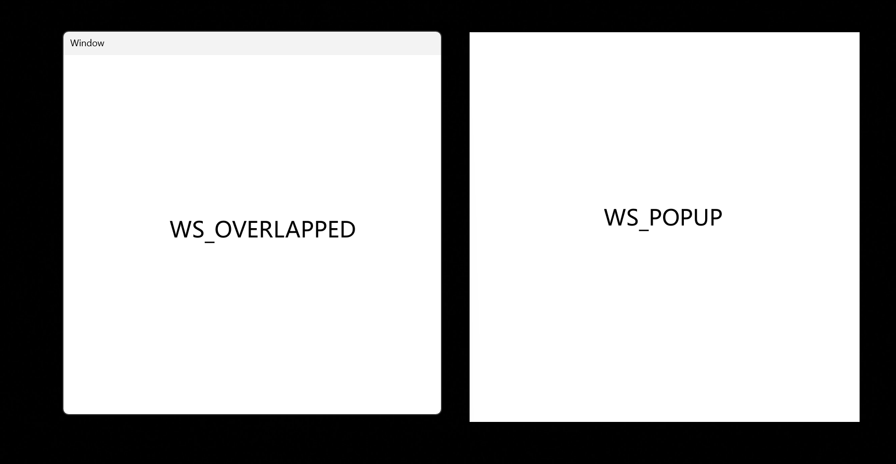

## 第一个窗口程序

Win32窗口按照一下顺序创建:

- 定义窗口 (WNDCLASSEX 结构体)
- 注册窗口 (RegisterClassEx)
- 创建窗口 
- 显示窗口
- 更新窗口 (非必须???)
- 消息循环
- 窗口过程 WndProc

##### WNDCLASSEX数据结构

```cpp
typedef struct _WNDCLASSEX {
    UINT     cbSize;             // 结构体的大小           //sizeof(WNDCLASSEX)
    UINT     style;              // 窗口样式
    WNDPROC  lpfnWndProc;        // 窗口处理程序
    int      cbClsExtra;         // 窗口类的附加数据大小    //0
    int      cbWndExtra;         // 窗口的附加数据大小      //0
    HANDLE   hInstance;          // 窗口类的应用程序实例句柄 
    HICON    hIcon;              // 窗口的图标
    HCURSOR  hCursor;            // 窗口的光标
    HBRUSH   hbrBackground;      // 窗口的背景画刷
    LPCSTR   lpszMenuName;       // 窗口菜单名称
    LPCSTR   lpszClassName;      // 窗口类名称
    HICON    hIconSm;            // 窗口的缩略图标
} WNDCLASSEX;
```

- cbSize: 必须设置为sizeof(WNDCLASSEX)

- style: 常见的style如下:

  | CS_VREDRAW \| CS_HREDRAW | 窗口的垂直方向和水平方向发生变化时，窗口会被重绘(V: Vertical   H:Horizontal) |
  | ------------------------ | ------------------------------------------------------------ |
  | **CS_DBLCLKS**           | **窗口可以接收双击消息, 用户双击时可以触发`WM_LBUTTONDBLCLK`或`WM_RBUTTONDBLCLK`消息** |
  | **CS_NOCLOSE**           | **禁用窗口关闭按钮**`x`                                      |

- lpfnWndProc: 窗口过程函数,函数原型如下:

  ```cpp
  LRESULT CALLBACK WindowProc(HWND hWnd, UINT uMsg, WPARAM wPara, LPARAM lPara);
  ```

- cbClsExtra: 窗口类的附加数据的大小, 通常设置为0

- cbWndExtra: 窗口的附加数据的大小, 通常设置为0

- hInstance: 窗口所属的应用程序的实例句柄。

- hIcon: 窗口的图标句柄， 可以使用`LoadIcon`函数导入。

- hCursor: 窗口光标的句柄, 可以通过`LoadCursor`或者`LoadImage`函数来自定义光标.

- lpszClassName: 窗口类名,窗口类的标识符,必须唯一.

- hIconsm: 窗口小型图标的句柄, `Icon  small`, 任务栏,窗口标题栏, 或者快捷方式上的图标。


##### CreateWindowEx函数

```cpp
HWND CreateWindowEx(
  DWORD     dwExStyle,       // 扩展样式
  LPCSTR    lpClassName,     // 窗口类名
  LPCSTR    lpWindowName,    // 窗口名称（标题）
  DWORD     dwStyle,         // 窗口样式
  int       x,               // 窗口左上角的 x 坐标
  int       y,               // 窗口左上角的 y 坐标
  int       nWidth,          // 窗口宽度
  int       nHeight,         // 窗口高度
  HWND      hWndParent,      // 父窗口句柄
  HMENU     hMenu,           // 菜单句柄
  HINSTANCE hInstance,       // 应用程序实例句柄
  LPVOID    lpParam          // 附加的窗口创建数据（可以是 NULL）
);
```

- dwstyleEx: 扩展样式

  | WS_EX_ACCEPTFILES | 窗口可以接收文件, 拖拽文件到窗口上,系统会发送WM_DROPFILES消息 |
  | ----------------- | ------------------------------------------------------------ |
  | **WS_EX_TOPMOST** | 该属性只能用在顶层窗口上, 用在子窗口上会被自动忽略, 设置这个属性的窗口会一直在其他窗口上面. |

- lpClassName: WNDCLASS中lpszClassName的值.

- lpWindowName: 窗口标题

- dwStyle:  窗口样式，

  ​	-  `WS_POPUP`:弹出式窗口,没有标题栏和边框,只有客户区

  ​	- `WS_OVERLAPPED`:重叠式窗口,自带标题栏



## 内存相关API


## 文件操作相关API


## 线程操作相关API


