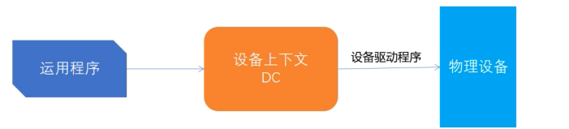

### 1. 基础概念

- GDI: Graphic Device Interface   图形设备接口
- GUI: Graphic User Interface  图形用户接口/界面
- DC: Device Context 设备上下文
- HDC: Handle of Device Context  设备上下文句柄

**1. 什么是 GDI ?**
Windows绘图的实质就是利用 Windows提供的 GDI 将图形绘制在显示器上.
GDI的主要目标之一是支持在各种输出设备(显示器、打印机等)上进行与设备无关的图形输出.
开发者只需要与GDI进行交互,无需关心当前硬件设备, 就可以让应用程序在支持Windows的任意图形输出设备上工作.

**2. 什么是DC ?**

DC称作设备上下文。
DC是Windows系统的一种数据结构, 保存了绘图操作中的一些信息.
DC保存的信息包括 画笔、画刷、字体、位图等等图形对象及属性, 以及坐标映射、颜色和背景等影响图形输出的绘图模式.

开发人员通过调用 Win32 API来向 DC 中写入或修改数据, 然后Windows系统通过设备驱动程序自动将DC中要表达的内容输出到物理设备上.

有四种类型的 DC: 显示器、打印机、内存、信息

**3. Graphic Object 有哪些**

- BitMap 位图
- Brush 画刷
- Palette 调色板
- Font 字体
- Pen 画笔
- Path
- Region