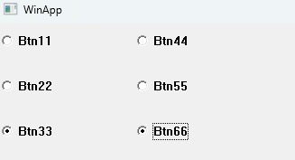

### 简介

1. 简介

按钮控件允许用户通过单击来执行操作, 既可以显示文本, 又可以显示图像.
按钮既是Windows标准控件, 也是子窗口, 窗口类名是 `Button`,大小写不敏感.


- 按钮 (Button)
- 单选按钮 (Radio Button)
- 复选框 (Check Box)

2. 创建按钮

按钮是一个子窗口, 可以通过`CreateWindow`函数来创建.

```cpp
CreateWindow(L"Button", L"click1", WS_CHILD|WS_VISIBLE|BS_PUSHBUTTON, 5, 5,
			50, 30, hWnd, HMENU(0xa11), ((LPCREATESTRUCT)lPara)->hInstance, NULL);

CreateWindow(L"Button", L"click1", WS_CHILD|WS_VISIBLE|BS_AUTORADIOBUTTON, 5, 5,
			50, 30, hWnd, HMENU(0xa12), ((LPCREATESTRUCT)lPara)->hInstance, NULL);

CreateWindow(L"Button", L"click1", WS_CHILD|WS_VISIBLE|BS_AUTOCHECKBOX, 5, 5,
			50, 30, hWnd, HMENU(0xa13), ((LPCREATESTRUCT)lPara)->hInstance, NULL);
```

第一个参数是`Button`, Windows系统内置的窗口类名, 大小写不敏感.
上面的 0xa11, 0xa12, 0xa13是按钮的ID, 并不是菜单句柄, 这个ID在处理 WM_COMMAND 消息时会用到.


重点是第三个参数, 它决定了按钮的样式.

WS_CHILD | WS_VISIBLE 基本上是固定搭配. BS开头是按钮的风格, 有以下常用风格.

- 普通按钮
- BS_PUSHBUTTTON
- BS_DEFPUSHBUTTOIN
  
- 单选按钮
- BS_RADIOBUTTON
- BS_AUTORADIOBUTTON

- 复选框
- BS_CHECKBOX
- BS_AUTOCHECKBOX


### PushButton

1. BS_PUSHBUTTON 和 BS_DEFPUSHBUTTON 有什么区别?

在对话框程序中,按下Enter键时,  BS_DEFPUSHBUTTON会收到一个 BN_CLICK命令消息, 即使当前焦点不在它上面(只要要焦点不在另一个按钮上即可). 

在非对话框窗口中, BS_DEFPUSHBUTTON 相对于 BS_PUSHBUTTON 会有一个粗黑边. 其它的基本没有区别.


2. 用户点击 BS_PUSHBUTTON 时代码逻辑是怎样的?

鼠标左键单击 BS_PUSHBUTTON 会产生 WM_COMMAND 消息.
该消息有两个附带参数

- LOWORD(wParam): Button ID
- HIWORD(wParam): Notification Code, 比如：BN_CLICKED
- lParam: 按钮窗口句柄

```cpp
LRESULT CALLBACK WindowProc(HWND hWnd, UINT msg, WPARAM wPara, LPARAM lPara)
{
	switch(msg)
	{
		case WM_COMMAND:
		{
			WORD id = LOWORD(wPara);
			WORD NotifyCode = HIWORD(wPara);
			HWND hBtn = (HWND)lPara;

			switch(NotifyCode)
			{
				case BN_CLICKED:
				{
					//
					自定义代码逻辑
				}
			}
		}break;
		case WM_DESTROY:
		{
			PostQuitMessage(0);
		}break;

		default:
			return DefWindowProc(hWnd, msg, wPara, lPara);
	}
}
```

### RadioButton

1. BS_RADIOBUTTON 和 BS_AUTORADIOBUTTON 两种风格有什么不同.


2. 假设有6个 RadioButtion, 123为一组, 456为一组. 怎么实现两组内部的按钮互斥?




两种方法:
- 使用 `WS_GROUP`样式.
- 使用 `CheckRadioButton`函数.


Windows的规则: 从带 WS_GROUP 样式的控件开始，到下一个带 WS_GROUP 的控件之前，属于同一组.

```cpp
// 123为一组. 1设置 WS_GROUP样式. 23不用.
hBtn1 = CreateWindow(L"Button", L"Btn11", WS_CHILD | WS_VISIBLE | BS_AUTORADIOBUTTON | WS_GROUP,
					 5, 5, 110, 30, hWnd, HMENU(0x1000), lpSt->hInstance, NULL);

hBtn2 = CreateWindow(L"Button", L"Btn22", WS_CHILD | WS_VISIBLE | BS_AUTORADIOBUTTON,
					 5, 55, 110, 30, hWnd, HMENU(0x1001), lpSt->hInstance, NULL);

hBtn3 = CreateWindow(L"Button", L"Btn33", WS_CHILD | WS_VISIBLE | BS_AUTORADIOBUTTON,
					 5, 105, 110, 30, hWnd, HMENU(0x1002), lpSt->hInstance, NULL);

//456为一组. 4设置 WS_GROUP样式. 56不用.
hBtn4 = CreateWindow(L"Button", L"Btn44", WS_CHILD | WS_VISIBLE | BS_AUTORADIOBUTTON | WS_GROUP,
					 155, 5, 110, 30, hWnd, HMENU(0x1003), lpSt->hInstance, NULL);

hBtn5 = CreateWindow(L"Button", L"Btn55", WS_CHILD | WS_VISIBLE | BS_AUTORADIOBUTTON,
					 155, 55, 110, 30, hWnd, HMENU(0x1004), lpSt->hInstance, NULL);

hBtn6 = CreateWindow(L"Button", L"Btn66", WS_CHILD | WS_VISIBLE | BS_AUTORADIOBUTTON,
					 155, 105, 110, 30, hWnd, HMENU(0x1005), lpSt->hInstance, NULL);
```


使用`CheckRadioButton`函数.
```cpp
BOOL CheckRadioButton(
  [in] HWND hDlg,
  [in] int  nIDFirstButton,
  [in] int  nIDLastButton,
  [in] int  nIDCheckButton
);
```

- hDlg: RadioButton的父窗口.
- nIDFirstButton : 最小ID
- nIDLastButton: 最大ID
- nIDCheckButton: 要点击的ID.

CheckRadioButton函数内部会进行一个遍历, 从First到Last(包含LastID)进行一个遍历
向CheckButto发送一个BM_CHECK消息. 向其它Button发送一个BM_UNCHECK消息.

> 使用此函数来实现RadioButton的分组, 按钮样式必须是 BS_RADIOBUTTON， 不能是 BS_AUTORADIOBUTTON.

```cpp
LRESULT CALLBACK WindowProc(HWND hWnd, UINT msg, WPARAM wParam, LPARAM lParam)
{
	switch (msg)
	{
		case WM_CREATE:
		{
			LPCREATESTRUCT lpSt = (LPCREATESTRUCT)lParam;

			hBtn1 = CreateWindow(L"Button", L"Btn11", WS_CHILD | WS_VISIBLE | BS_RADIOBUTTON,
								 5, 5, 110, 30, hWnd, HMENU(0x1000), lpSt->hInstance, NULL);

			hBtn2 = CreateWindow(L"Button", L"Btn22", WS_CHILD | WS_VISIBLE | BS_RADIOBUTTON,
								 5, 55, 110, 30, hWnd, HMENU(0x1001), lpSt->hInstance, NULL);

			hBtn3 = CreateWindow(L"Button", L"Btn33", WS_CHILD | WS_VISIBLE | BS_RADIOBUTTON,
								 5, 105, 110, 30, hWnd, HMENU(0x1002), lpSt->hInstance, NULL);

			hBtn4 = CreateWindow(L"Button", L"Btn44", WS_CHILD | WS_VISIBLE | BS_RADIOBUTTON,
								 155, 5, 110, 30, hWnd, HMENU(0x1003), lpSt->hInstance, NULL);

			hBtn5 = CreateWindow(L"Button", L"Btn55", WS_CHILD | WS_VISIBLE | BS_RADIOBUTTON,
								 155, 55, 110, 30, hWnd, HMENU(0x1004), lpSt->hInstance, NULL);

			hBtn6 = CreateWindow(L"Button", L"Btn66", WS_CHILD | WS_VISIBLE | BS_RADIOBUTTON,
								 155, 105, 110, 30, hWnd, HMENU(0x1005), lpSt->hInstance, NULL);


		} break;
		case WM_COMMAND:
		{
			WORD id = LOWORD(wParam);
			WORD code = HIWORD(wParam);
			HWND hBtn = HWND(lParam);

			switch (id)
			{
				case 0x1000:
				case 0x1001:
				case 0x1002:
					CheckRadioButton(hWnd, 0x1000, 0x1002, id);
					break;

				case 0x1003:
				case 0x1004:
				case 0x1005:
					CheckRadioButton(hWnd, 0x1003, 0x1005, id);
					break;
			}
		} break;
		case WM_DESTROY:
		{
			PostQuitMessage(0);
		} break;
		default:
			return DefWindowProc(hWnd, msg, wParam, lParam);
	}
}
```


**4. 按钮的 State**

**4. BS_CHECKBOX 和 BS_AUTOCHECKBOX 有什么区别?**


**3. 按钮消息**

按钮控件会向父窗口发送命令消息`WM_COMMAND`

- BN_CLICKED:  用户单击鼠标会向父窗口发送 BN_CLICKED 消息.
- BN_DOUBLECLICKED: 双击鼠标会向父窗口发送 BN_DOUBLECLICKED 消息.


WM_COMMAND的两个附带参数中有附带信息:

- LOWORD(wParam)可以得到按钮ID, 知道哪个按钮被点击了
- HIWORD(wParam)是Notification code, 比如 BN_CLICKED, BN_DBCLK等, 标志用户对控件的操作, 双击,单击之类.
- lParam : 按钮的句柄.
   


**4. 如何获取单选按钮和复选按钮的状态**

想要获取单选按钮或复选框的选中状态, 可以使用`SendMessage`向控件发送`BM_GETCHECK`消息.
也可以直接使用`Button_GetCheck`宏, 其返回值为:
- BST_CHECKED: 按钮被选中
- BST_INDETERMINATE: 表示处于不确定状态(仅在按钮具有`BS_3STATE`或者`BS_AUTO3STATE`样式时适用).
- BST_UNCHECKED: 按钮被清除.


**5. 按钮的自动模式与手动模式**

在调用CreateWindow创建按钮时, 比如复选框按钮, 可以选择下面两种样式:
- WS_CHILD | WS_VISIBLE | BS_CHECKBOX
- WS_CHILD | WS_VISIBLE | BS_AUTOCHECKBOX


其中 BS_CHECKBOX 是手动模式的复选框. BS_AUTOCHECKBOX 是自动模式的复选框.
手动模式: 用户点击复选框, 复选框不会自动改变状态, 需要用户发送 `SendMessage`函数来通知按钮改变状态.
自动模式则会自动改变状态.


**6. 按钮自绘制**


### Cotrol Message 控件消息

Button的 Control Message 是父窗口发送给按钮控件的消息, 用于查询或设置按钮的状态、外观和行为.
与 Notification Code (按钮-->父窗口)相反, Control Message是父窗口到按钮的单向通信.

父窗口通过 `SendMessage`函数向按钮发送控制消息.

```cpp
// 发送控制消息的通用格式
LRESULT result = SendMessage(
    hwndButton,     // 按钮句柄
    BM_XXX,         // 按钮控制消息(Button Message)
    wParam,         // 附加参数1
    lParam          // 附加参数2
);
```


**状态设置消息:**

- BM_SETCHECK
  - 作用: 设置按钮状态
  - wParam:
    - BST_CHECKED: 选中状态
    - BST_UNCHECKED: 清除选中状态
    - BST_INDETERMINATE: 不确定状态, 只能在按钮有 BS_3STATE 或者 BS_AUTO3STATE 时使用
  - lParam: 0
  - Note:
    - SendMessage(hBtn, BM_SETCHECK, BST_CHECKED, 0) 函数只能用于 RadioButton 和 CheckBox
    - 如果2个Radiobutton在同一个Group里面, 同时发送BST_CHECKED, 即使它们互斥，也都会被选中.


- BM_SETSTATE

- BM_SETSTYLE

- BM_SETIMAGE

- BM_CLICK


**状态查询消息:**

- BM_GETCHECK
  - 作用: 获取选中状态
  - wParam: 0
  - lParam: 0
  - Return Value
    -  BST_CHECKED
    -  BST_UNCHECKED
    -  BST_INDETERMINATE
 - Note:
   - SendMessage(hBtn, BM_GETCHECK, 0, 0) 只能用于查询 RadioButton 和 CheckBox 的状态.

- BM_GETSTATE
	- 作用: 获取按钮状态
	- wParam: 0
	- lParam: 0
	- Return Value: 组合状态标志


- BM_GETIAMGE
	- 作用: 获取按钮图像
	- wParam
    	- IMAGE_BITMAP
    	- IMAGE_ICON
  	- lParam : 0
    - Return Value : 图像句柄


- BM_GETSTYLE
  - 作用: 获取按钮样式值


### Notification Code  通知代码

Button控件的 Notification Code(通知代码)是按钮在发生特定事件时,
通过 WM_COMMAND 消息发送给父窗口的通知标识,告诉父窗口按钮发生了什么状态变化.

Windows系统提供了一系列宏, 以BN开头, Button Notify 的缩写.

- BN_CLICKED: 鼠标左键单击
  
- BN_DOUBLECLICKED: 鼠标左键双击
  
- BN_DISABLE
  
- BN_KILLFOCUS
  
- BN_SETFOCUS
  
- BN_PAINT

- 下面已弃用, 为了兼容早期 16 位的Windows系统
- BN_PUSHED
- BN_UNPUSHED
- BN_HILITE
- BN_UNHILITE


### CheckBox


**实现批量操作 (比如 全选)**