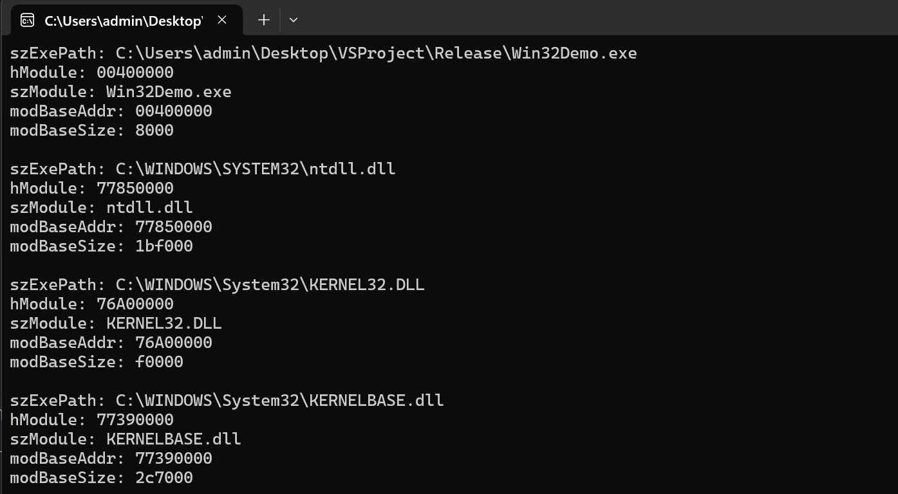

## TlHelp32


### MODULEENTRY32

```cpp
typedef struct tagMODULEENTRY32 {
  DWORD   dwSize;
  DWORD   th32ModuleID;
  DWORD   th32ProcessID;
  DWORD   GlblcntUsage;
  DWORD   ProccntUsage;
  BYTE    *modBaseAddr;
  DWORD   modBaseSize;
  HMODULE hModule;
  char    szModule[MAX_MODULE_NAME32 + 1];
  char    szExePath[MAX_PATH];
} MODULEENTRY32;
```

- th32ProcessID: module所在虚拟进程地址空间的进程PID
- modBaseAddr:  module在进程虚拟地址空间的起始地址.
- modBaseSize: module在进程虚拟地址空间的大小.
- hModule: moudle的句柄, 
    - 与 `GetModuleHandle`函数的返回值相同, 也和`modBaseAddr`值相同.
    - 32位程序, 关闭基址重定位的情况下, 镜像基址就是0x00400000
- szModule: module的名字
- szExePath: module对应的文件的绝对路径


```cpp
int main()
{
	HANDLE hSnapshot = CreateToolhelp32Snapshot(TH32CS_SNAPMODULE, GetCurrentProcessId());

	if (hSnapshot == INVALID_HANDLE_VALUE)
	{
		std::cout << "error\n";
		system("pause");
		return 0;
	}

	std::vector<MODULEENTRY32> vecmod;
	MODULEENTRY32 md;
	md.dwSize = sizeof(md);
	BOOL bRes = Module32First(hSnapshot, &md);
	
	while (bRes)
	{
		vecmod.push_back(md);
		bRes = Module32Next(hSnapshot, &md);
	}
	for (auto& m : vecmod)
	{
		std::wcout << "szExePath: " << m.szExePath << "\n"
			<< "hModule: " << std::hex << m.hModule << "\n"
			<< "szModule: " << m.szModule << "\n"
			<< "modBaseAddr: " << std::hex << m.modBaseAddr << "\n"
			<< "modBaseSize: " << std::hex << m.modBaseSize << "\n\n";

	}

	CloseHandle(hSnapshot);
	system("pause");
	return 0;
}
```




### PROCESSENTRY32

```cpp
typedef struct tagPROCESSENTRY32 {
  DWORD     dwSize;
  DWORD     cntUsage;
  DWORD     th32ProcessID;
  ULONG_PTR th32DefaultHeapID;
  DWORD     th32ModuleID;
  DWORD     cntThreads;
  DWORD     th32ParentProcessID;
  LONG      pcPriClassBase;
  DWORD     dwFlags;
  CHAR      szExeFile[MAX_PATH];
} PROCESSENTRY32;
```

- dwSize: 必须设置为 sizeof(PROCESSENTRY32), 否则`Process32First`会调用失败.
- th32ProcessID: 进程的PID
- szExeFile: 进程的名字, 获取进程可执行文件完整路径，可以通过`MODULEENTRY32`中的`szExePath`得到.


### CreateToolhelp32Snapshot

```cpp
HANDLE CreateToolhelp32Snapshot(
  [in] DWORD dwFlags,
  [in] DWORD th32ProcessID
);
```

- dwFlags: 
  - TH32CS_SNAPPROCESS: 获取系统进程快照
  - TH32CS_SNAPMODULE: 获取指定进程的module快照.
  
- th32ProcessID: 获取module快照时, 传入进程PID, 获取进程快照传入0.


## PSAPI


## NTQuerysystemInfomation


## WMI


